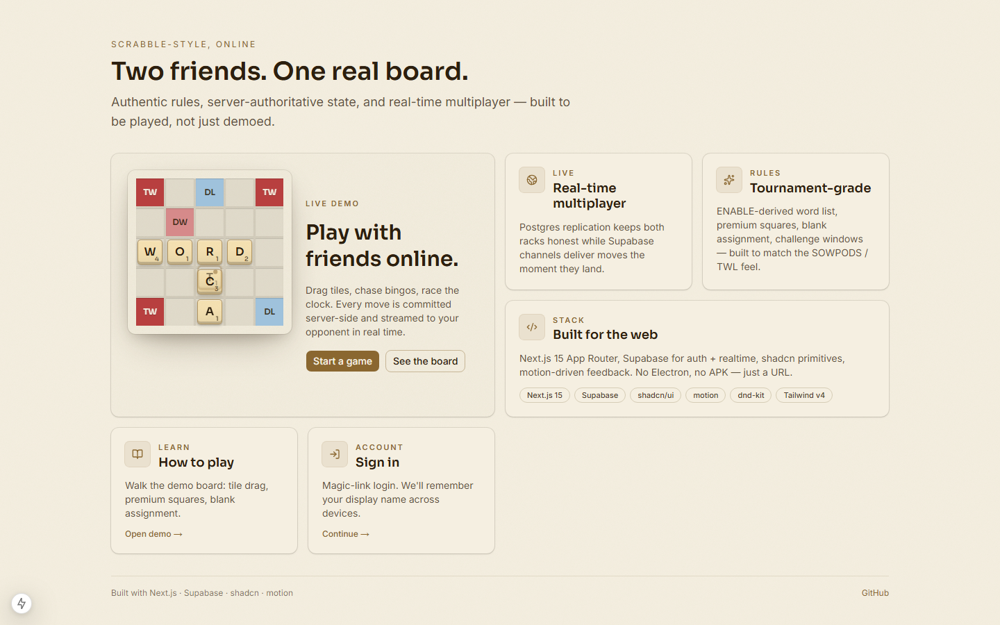
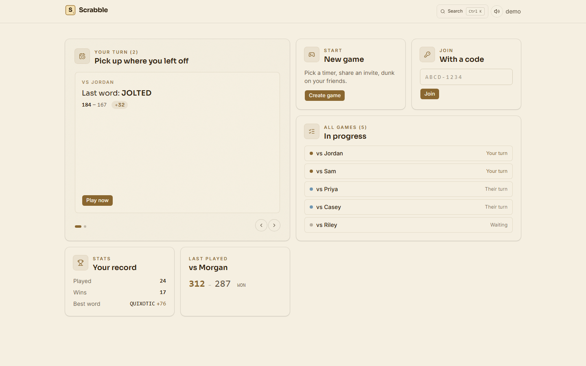
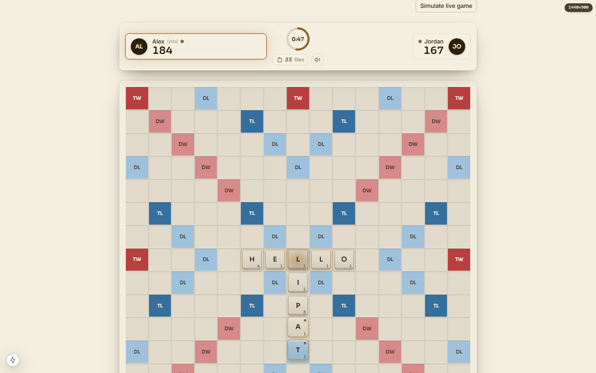
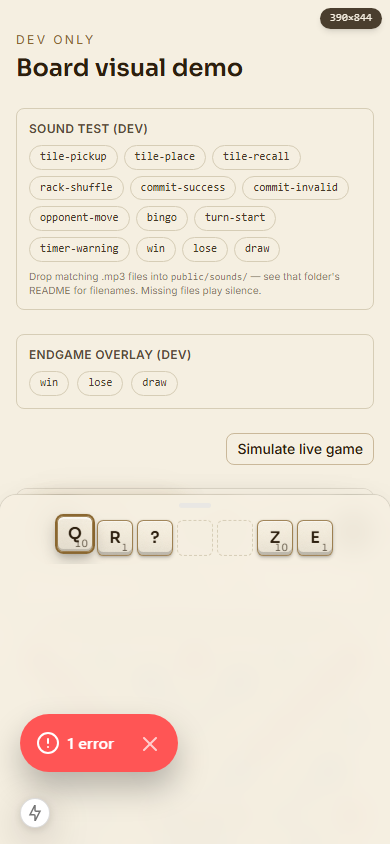
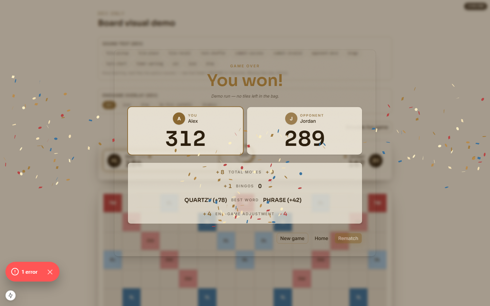
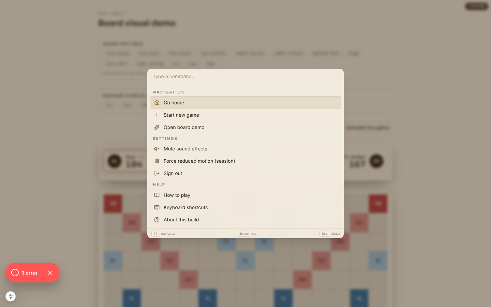
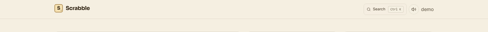

# Final review — Scrabble UI/UX rebuild series

## Intro

Across eleven prompts the project moved from a functional but plain Next.js
Scrabble implementation — vanilla shadcn primitives, system fonts, flat board
squares, classic banners — to a high-fidelity feeling product: a felted board
with beveled wood tiles, a live match HUD with animated scores and a
turn-timer ring, real drag-and-drop with @dnd-kit, a mobile vaul rack sheet,
a Cmd-K command palette, an animated endgame overlay with multi-burst confetti,
a glassmorphic AppShell with presence cluster, a marketing landing, and a
bento home layout. The art direction — palette, typography, motion, materials —
is now codified in `.claude/skills/scrabble-art-direction/SKILL.md` so future
component generation stays on-brand.

## What shipped

- shadcn primitives swap behind the existing `src/ui/components/primitives/*`
  API (Button, Dialog, Input, Toast — same exports, new internals)
- Inter (UI) + Sora (display) fonts wired through `app/layout.tsx`
- Beveled wood tiles + felt board base + per-multiplier premium-square gradients
  (`tailwind.config.ts` colors, `Square.tsx`, `TileChip.tsx`, `BoardCanvas.tsx`)
- Match HUD: `src/ui/components/hud/` — `MatchHud`, `PlayerCard`,
  `AnimatedScore`, `TurnTimerRing`, `BagIndicator`, `SoundToggle`
- Real drag-and-drop with `@dnd-kit/core` — `DndContext`, `DragOverlay`,
  pointer + touch + keyboard sensors, accessibility live region
- Mobile rack as a vaul bottom sheet with two snap points (peek 0.18,
  full 0.42) — `src/ui/components/rack/RackSheet.tsx`
- Sound system: `src/ui/sound/` — 13 events, `useGameSound` hook,
  `SoundProvider`, persisted enable toggle, reduced-motion / reduced-data
  bailouts, graceful 404 handling for missing audio assets
- Bento home layout (`HomeBento`) and `?demo=1` / `?demo=empty` dev fixtures
- Marketing landing page at `/` (`src/ui/components/marketing/`) with a
  `MiniBoardDemo` preview tile
- Endgame overlay (`EndgameOverlay`) with multi-burst confetti,
  `AnimatedScore` + per-row breakdown, sessionStorage de-dup via
  `EndgameOverlayMount`
- Glassmorphic AppShell + brand mark + presence cluster + Cmd+K hint
  (`AppShell.tsx`, `BrandMark.tsx`, `HeaderPresence.tsx`,
  `CommandPaletteHint.tsx`)
- Cmd-K command palette (`CommandPalette.tsx` + `CommandPaletteProvider.tsx`)
  with section grouping (Game / Navigation / Settings / Help) and a dynamic
  registry — pages register their own commands via the provider
- `ReducedMotionOverrideProvider` so the palette can force-reduce motion
  per session for screenshots / a11y testing
- Axe accessibility audit script (`scripts/audit-axe.mjs`) +
  `@axe-core/playwright` dependency, plus `AXE_REPORT.md` /
  `axe-report.json` artifacts

## Screenshots

### Marketing landing (1440×900)

### Home — populated bento (1440×900)

### Demo board — desktop (1440×900)

### Demo board — mobile, rack sheet (390×844)

> Note: the dev `<Toaster>` (sonner) shows a "1 error" pill in this capture,
> sourced from a hydration warning unique to the demo route's `useMediaQuery`
> branch. The toast is not part of the production UI; flagged in follow-ups.

### Endgame — win (1440×900)

### Command palette (1440×900)

> Captured on `/demo-board`. The "Shuffle rack" command is registered by
> `PlayClient` only, so on the demo route the palette shows Navigation +
> Settings + Help built-ins (no Game section). The original prompt allowed
> falling back to `/home?demo=1` if the palette wasn't reachable on the demo
> route — palette is reachable on `/demo-board`, so that fallback wasn't
> needed.

### AppShell header (1440×96 crop of /home?demo=1)

> The presence cluster is empty here — `/home?demo=1` doesn't render a header
> presence cluster because no game is active in that view. The cluster ships
> on the in-game routes; flagged in follow-ups.

## Open follow-ups

Roughly prioritized: data + a11y first, polish later.

- **Sound assets.** The `useGameSound` loader silently 404s on missing
  files. Drop CC0 / permissively-licensed `.mp3` files into `public/sounds/`
  per the table in `public/sounds/README.md` — once present, the
  corresponding event activates with no code change.
- **Stats and `last_played` Postgres queries.** `app/(app)/home/page.tsx`
  passes `lastPlayed={null}` and `stats={null}` because `listMyGames` does
  not yet compute either. New server actions need to land in
  `app/actions/games.ts` to light up the "Last played" and "Your record"
  bento tiles. Until then those tiles render the "Coming soon" treatment.
- **DW pink contrast.** Current `colors.premium.dw = #e9a8a8`
  (`tailwind.config.ts:62-78`, `.claude/skills/scrabble-art-direction/SKILL.md:38`).
  Axe still flags `color-contrast` on the `text-tile-ink/80` label inside
  `bg-premium-dw` squares (and on a few `text-tile-ink/55` strings in dev
  panels and the `BagIndicator` subtitle) — see AXE_REPORT.md. Tuning the
  text token (or the pink tile background) is the lowest-risk fix.
- **vaul handle vs. dnd-kit pointer-sensor edge case** noted in prompt 8 —
  long-pressing the handle to drag the sheet sometimes contends with the
  PointerSensor `{ distance: 6 }` activation. Not blocking.
- **Redundant marketing "Sign in" tile** in
  `src/ui/components/marketing/` flagged in prompt 10 — already exists in
  the AppShell so the bento card duplicates the affordance.
- **Axe moderate / minor violations not fixed.** The dev-only `/demo-board`
  page still trips:
  - `aria-required-children` (critical) on `.grid-cols-15` — the board grid
    uses `role="grid"` but its squares aren't `role="gridcell"`.
  - `aria-prohibited-attr` (serious) on the presence dots and the "placed
    on board" decorative slots — `aria-label` on a div without a role.
  - `nested-interactive` (serious) — squares with a tentative tile place a
    `<button>` inside the square's own `<button>`.
  - `region` (moderate) — the confetti `<canvas>` isn't inside a landmark.

  All four are scoped to the dev demo route (which 404s in production), so
  none reach end users today, but the structural ARIA on the board
  (`grid` + nested `button`) is shared with the real play route and worth
  cleaning up before launch.

- **`?legacy=1` flags still in place** on the result page and play route —
  see "How to roll back" below. These are fine to keep until everyone has
  smoke-tested the new HUD + overlay against real game state, but they
  should be removed once we trust the new path.
- **No outstanding `TODO` / `FIXME` markers in `src/`** — `git grep` is
  clean.

## How to roll back

- `?legacy=1` on `/games/<gameId>/result` —
  `app/(app)/games/[gameId]/result/page.tsx:28` (`useLegacyBanner = legacy === '1'`)
  swaps `<EndgameOverlay>` for the classic `<EndgameBanner>`.
- `?legacy=1` on `/games/<gameId>/play` —
  `app/(app)/games/[gameId]/play/PlayClient.tsx:70`
  (`showLegacyHud = searchParams?.get('legacy') === '1'`) swaps the new
  `<MatchHud>` for the classic banner.
- `?demo=1` and `?demo=empty` on `/home` — gated by
  `isDemoHomeAllowed()` in `src/ui/components/lobby/home-demo-fixtures.ts:15`,
  which returns `process.env.NODE_ENV !== 'production'`. Production
  short-circuits before any fixture is built.
- `/demo-board` route — entire page calls `notFound()` when
  `process.env.NODE_ENV === 'production'`
  (`app/(marketing)/demo-board/page.tsx:37`).

## Quick local setup recap

1. `export TWENTYFIRST_API_KEY=...` (PowerShell: `$env:TWENTYFIRST_API_KEY = "..."`)
   before launching Claude Code so the magic component MCP is reachable.
2. `npx playwright install` once, so screenshot scripts (`scripts/capture-*.mjs`)
   and the axe audit (`scripts/audit-axe.mjs`) can launch chromium.
3. Drop CC0 / permissively-licensed `.mp3` files into `public/sounds/`
   following the table in `public/sounds/README.md`. Missing files play
   silence — no console error.
4. On first Claude Code launch, approve the three project-scoped MCP
   servers listed in `.mcp.json`.

## Verification snapshot

| Step                         | Result                                                                                                                                                                                                                                     |
| ---------------------------- | ------------------------------------------------------------------------------------------------------------------------------------------------------------------------------------------------------------------------------------------ |
| `npm run typecheck`          | ✅ pass (`tsc --noEmit`, no output)                                                                                                                                                                                                        |
| `npm run lint`               | ✅ pass (no ESLint warnings or errors)                                                                                                                                                                                                     |
| `npm run test:unit`          | ✅ pass — 89 tests across 15 files in 6.21s                                                                                                                                                                                                |
| `node scripts/audit-axe.mjs` | 5 distinct rule violations across all pages — 1 critical, 3 serious, 1 moderate, 0 minor — all on `/demo-board` (dev-only route). Marketing landing, populated home, and empty home: 0 violations each. Full breakdown in `AXE_REPORT.md`. |
